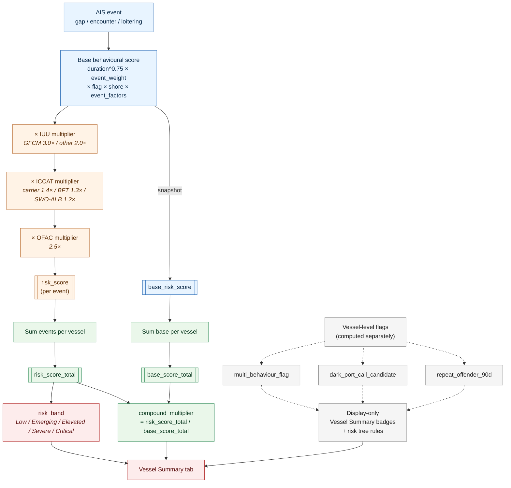
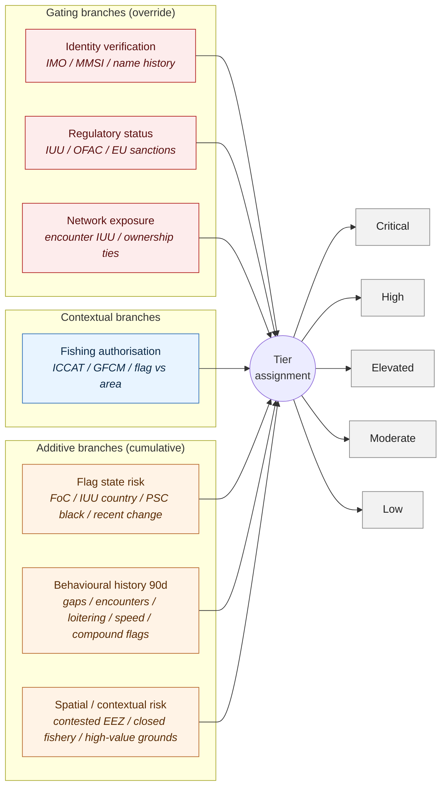

# Med Vessel Behaviour Monitor

**Predictive risk intelligence for Mediterranean fishing vessels**
A fisheries application of Kpler's six-layer risk framework

*Eirini Mantzouni — emantzo@hotmail.com*
*GitHub / live demo: …*

---

## The thesis

> Enforcement actions don't come from nowhere — they follow behavioural evidence trails.
> Quantify exposure **before** the listing happens.

The same methodological move Kpler has made for sanctions (80% spoofing-to-sanction probability within 12 months, concentrated in months 3–9) applied to RFMO IUU listings and port-state enforcement in the Mediterranean.

---

## The scoring pipeline

Three chains converge on the Vessel Summary tab: the per-event multiplicative chain, the vessel-level aggregation that produces a base-vs-compound decomposition, and the dashed side-chain of three vessel-level behavioural flags that are *displayed alongside* the score but are **not** multiplied into it.

**One line:** `risk = (duration_h^0.75) × event_weight × flag × shore × event_factors × iuu × iccat × ofac`

---

## Methodology — factor reference

Replicates and extends the GFW transshipment methodology (Miller et al. 2018, *The Global View of Transshipment*). GFW classifies an encounter when two vessels are within 500 m, for ≥2 h, at median speed <2 kn, ≥10 km from a coastal anchorage.

**Event weights** — ENCOUNTER 5.0 (transshipment), GAP 3.2 (dark activity), LOITERING 2.0 (staging).

**Non-linear duration** — `duration_h^0.75` prevents a single extreme event from dominating.

**Flag multipliers** — RUS 2.8, IRN 2.4, PRK 3.0, SYR 2.0, LBR 1.3, PAN 1.2, MHL 1.2, others 1.0. (Libya is in the "others" bucket — no explicit multiplier, the risk comes via behaviour, not passport.)

**Shore distance factor** (all event types)
- `>20 nm` (37 km): 1.5× — high-suspicion zone, GFW "likely transshipment" threshold
- `>10 km`: 1.2× — GFW encounter threshold
- `<10 km`: 0.8× — near-shore, less suspicious

**Encounter-specific factors**
- Proximity: `<500 m` = 1.8× (GFW threshold), `<1 km` = 1.3×
- Speed: median `<2 kn` = 1.5× (GFW "likely transfer" threshold)
- Counterparty type: carrier / tanker = 1.4×

**Loitering-specific factors**
- Counterparty type: carrier / tanker = 1.6× (GFW "potential transshipment" = reefer loitering alone)
- Speed: avg `<2 kn` = 1.4× (staging behaviour)

**Gap-specific factors**
- Speed change: `|v_before − v_after| > 5 kn` = 1.5× (evasion indicator), `> 2 kn` = 1.2× (moved, went dark, reappeared at a different speed)

**Compliance multipliers** (applied after base snapshot)
- IUU: GFCM-listed 3.0× / other RFMO 2.0×
- ICCAT: Carrier 1.4× / BFT 1.3× / SWO-ALB 1.2×
- OFAC SDN: 2.5×

**Risk bands** (Kpler "Turning Tides", Dec 2025, half-open intervals)
- Low `<50`  │  Emerging `50–60`  │  Elevated `60–80`  │  Severe `80–100`  │  Critical `≥100`

---

## Worked example — a Libyan-flagged gap event

| Step | Factor | Value | Running score |
|---|---:|---:|---:|
| 18 h GAP event | duration^0.75 × 3.2 | 8.8 × 3.2 | **28.2** |
| Flag (Libya → FoC) | × 1.0 | — | 28.2 |
| 12 km offshore | × 1.2 shore | — | 33.8 |
| Base score snapshotted | | | **33.8 → Low** |
| IUU-listed (GFCM) | × 3.0 | | 101.5 |
| ICCAT BFT-catching | × 1.3 | | 131.9 |
| **Final band** | | | **Critical** |

Same event. Behavioural base says "Low". Structural amplifiers move it to "Critical". The analyst sees both numbers, so the compounding is auditable rather than opaque.

---

## Five data sources, five epistemologies

| # | Source | Scale | Epistemic role |
|---|---|---|---|
| 1 | **GFW Events API** — gap / encounter / loitering | Live, Med polygon | Observed behaviour |
| 2 | **EU JRC FDI** — effort & landings by c-square × quarter × gear × species | 83k effort rows, 212k landing rows, 27 gear types | Statistical estimate of legitimate activity |
| 3 | **TMT Combined IUU List** — 13 RFMOs | 369 vessels (168 with IMO, 64 with MMSI) | Confirmed enforcement |
| 4 | **ICCAT Record of Vessels** — Med-authorised | 9,203 vessels, species-weighted multipliers | Authorisation as *opportunity*, not exoneration |
| 5 | **OFAC SDN** — US Treasury sanctioned vessels | ~50 vessels | Hard sanctions flag |

Base behavioural score is snapshotted between step 1 and steps 3–5 so the final report can decompose any vessel into **base × compound multiplier**.

---

## Mapping to Kpler's six-layer risk framework

From *How Deception Detection Works* and the Dec 2025 "Turning Tides" paper:

| Kpler layer | Med Vessel Monitor equivalent | Status |
|---|---|---|
| 1. Formal sanctions status | TMT IUU + OFAC SDN screening | **Implemented** |
| 2. Behavioural indicators | GFW gap / encounter / loitering, duration^0.75 weighted | **Implemented** |
| 3. Associative risk | — | **Gap — Maritime 2.0 plugs in here** |
| 4. Geographic risk | GSA zoning, shore factor, Libya/Tunisia hotspots | **Implemented** |
| 5. Cargo risk | ICCAT species tiers (carrier 1.4× / BFT 1.3× / SWO-ALB 1.2×) | **Implemented (fisheries-cargo equivalent)** |
| 6. Ownership opacity | `flag_multiplier` only (FoC proxy) | **Partial — beneficial ownership missing** |

**Four of six implemented. The two named gaps — associative risk and beneficial ownership — are exactly the layers where Kpler's Maritime 2.0 ownership graph and fleet-association data add value on top of an open-source stack.**

---

## Med IUU Risk Tree — compound logic, not multiplication

Adapted from Kpler's April 2026 *How to build a risk tree to assess shadow fleet exposure* for fisheries. Seven branches feed into five tier outcomes. Branches are typed:

- **Gating** (override) — identity, regulatory status, network exposure. Any hit forces a minimum tier regardless of other signals.
- **Additive** (cumulative) — flag state risk, behavioural history, spatial context. Flags accumulate; three or more escalate one tier.
- **Contextual** (direction-dependent) — authorisation. ICCAT/GFCM rights are opportunity indicators, not exonerations.

**Key tier-assignment rules** (from `data/risk_tree_framework.yaml`):
- `OFAC sanctioned` OR (`IUU listed` AND `ICCAT authorised` AND `active suspicious behaviour`) → **Critical**
- `GFCM IUU listed` → **High** minimum
- `Non-cooperating flag` AND (`multiple AIS gaps` OR `encounter with carrier`) → **Elevated** minimum
- `Identity unverifiable` AND any behavioural flag → **Elevated** minimum
- Three or more additive flags → escalate one tier

The risk-tree view is the **compound-logic** counterpart to the multiplicative score above: the score surfaces degree of exposure, the tree surfaces *why*. Both are rendered in the app — the scoring pipeline in the Reference & Methodology tab, the tree in the same tab plus per-vessel in the Investigation tab.

---

## What's also in the app (not scored, shown as context)

- **Three display-only behavioural flags**: multi-behaviour, dark-port-call candidate, repeat-offender 90d — mirrors three of the six inputs in Kpler's Oct 2025 Deceptive Shipping Practices model
- **FDI gear mix per c-square** (27 FAO gear codes, top-5 shown) — spatial context, feeds the planned gear-consistency check (does the vessel's movement match the local fleet profile?)
- **AI Maritime Analyst** (Google Gemini 2.5 Flash) with RAG over 5 methodology/IUU context documents and sandboxed code execution — the domain-specific analogue of Kpler's MCP beta
- **Per-vessel Investigation tab** with a coloured risk-tree path — the visual analogue of Dimitris's tiered Yellow/Orange/Red flag system, but continuous

---

## Planned next iterations (honest gaps)

1. **Gear-consistency check** — use FDI c-square gear mix plus a vessel-level gear source (MarineTraffic, ICCAT) to flag vessels whose movement pattern is inconsistent with the local fleet profile. Ingredients already on disk.
2. **Identity inconsistency layer** — name/flag/IMO cross-reference for vessels with suspicious naming histories (the PABLO case, seven prior names, is the canonical illustration).
3. **Associative / adjacency risk** — propagate risk across encounters, carrier servicing networks, and fleet co-operation.
4. **Spoofing detection** — not yet implemented; fisheries spoofing is rarer than tanker spoofing but increasingly relevant for small-scale fleets.

---

## References

- Miller, N. A., Roan, A., Hochberg, T., Amos, J., & Kroodsma, D. A. (2018). Identifying global patterns of transshipment behavior. *Frontiers in Marine Science*, 5, 240. https://doi.org/10.3389/fmars.2018.00240
- Rodriguez-Diaz, E., Alcaide, J. I., & Endrina, N. (2025). Shadow Fleets: A Growing Challenge in Global Maritime Commerce. *Applied Sciences*, 15(12), 6424. https://doi.org/10.3390/app15126424
- Kpler (2025, December). *Turning Tides: Maritime Risk and Compliance Insights 2025–2026*.
- Kpler (2025, November). *AIS Spoofing: Fast Track to Sanctions*.
- Kpler (2025). *How Deception Detection Works*.
- Kpler (2025, March). *The Grey Fleet: Shadow Operations in Global Oil Trade*.
- STECF / EU JRC. *Fisheries Dependent Information (FDI) 2017–2024, Mediterranean supra-region (MBS)*.
- TMT / Trygg Mat Tracking. *Combined IUU Vessel List* (13 RFMOs).
- ICCAT. *Record of Vessels authorised to operate in the ICCAT Convention Area*.
- US Treasury OFAC. *Specially Designated Nationals and Blocked Persons List* — vessel entries.
